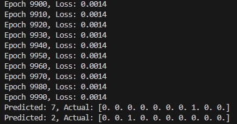

# Number_Recognition_NN

A nuerel network designed to identify hand drawn numbers

its able to be customised to be train on any other simple tasks with its:

Customisable hidden layers size and shape.
Whole training intake which is capable to take a list of multi training data at time.

Trained to a 99.86% accuracy estimate:  
  
